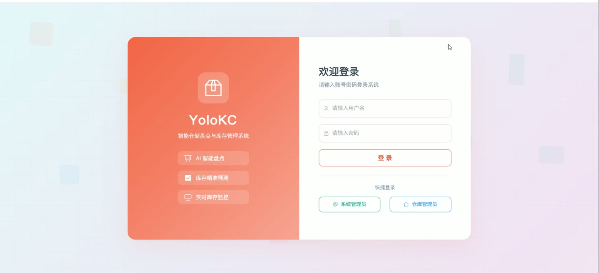
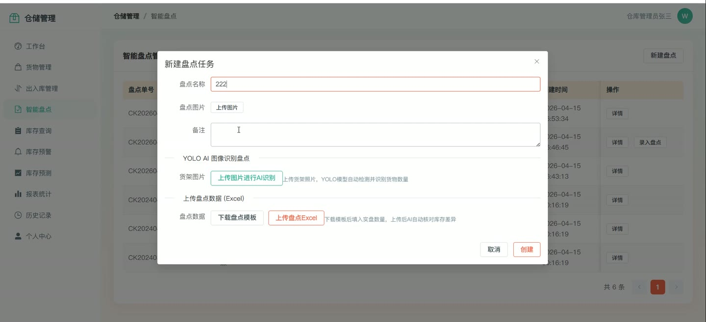
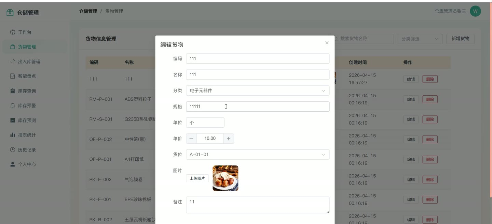
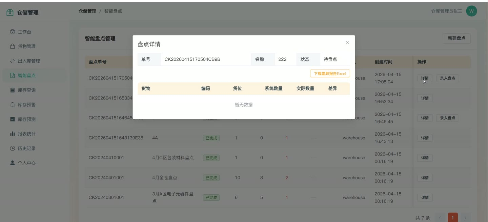
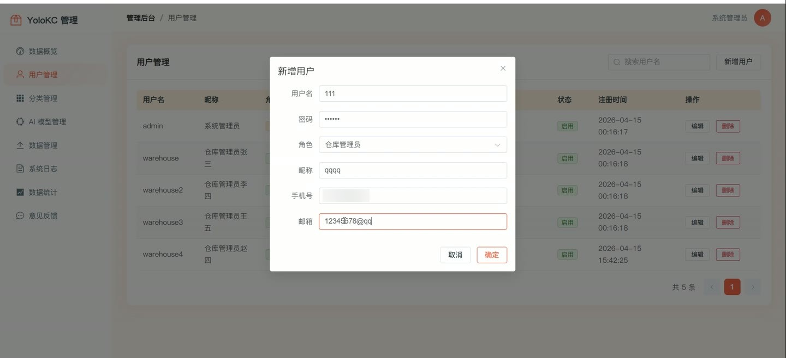
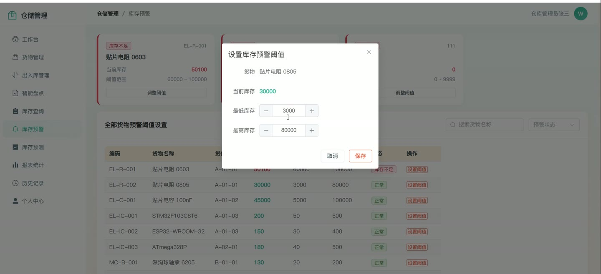

# (附文档)Python+Django+YOLO 工厂仓储货架货物智能盘点与库存管理系统

**技术栈**：Python、Django、机器学习、Vue3、MySQL

### 系统简介

本系统是一套基于 Python + Django + Vue3 的工厂仓储货架货物智能盘点与库存管理系统，采用前后端分离架构，后端提供 RESTful API，前端为 Vue3 单页应用。系统内置两类角色：系统管理员与仓库管理员，覆盖货物信息、货位管理、出入库、调拨、智能盘点、库存预警、库存预测、数据导入导出与日志分析等完整仓储业务链路。
 
### 核心功能
 
### 管理员端

 
- 数据看板：查看货物总数、库存总量、分类数量、盘点完成率、本月出入库汇总等核心指标。 
- 用户管理：分页查询用户列表并支持按用户名搜索，新增用户时设置用户名、密码、角色、昵称、手机号与邮箱。 
- 用户编辑：修改用户昵称、手机号、邮箱、角色与启用状态，可重置指定用户密码。 
- 用户停用：对指定账号执行停用操作，并禁止删除当前登录账号自身。 
- 货物分类管理：新增、编辑、删除货物分类，维护父分类、排序号与备注信息。 
- AI 模型管理：查看模型名称、类型、版本、参数、准确率与状态，并可更新模型版本、参数与启用状态。 
- 系统日志：按日志类型筛选登录日志、操作日志与模型日志，查看操作人、模块、动作、详情与 IP。 
- 数据导出：按货物或库存类型导出 Excel，包含编码、名称、规格、单位、单价、数量、货位与分类字段。 
- 数据导入：上传 Excel 批量导入货物，自动创建货位与库存记录，并生成对应入库单。 
- 导入模板下载：下载预置示例数据的货物导入 Excel 模板，含编码、名称、规格、单位、单价、数量、货位编码表头。 
- 数据分析：统计货物总数、库存总量、分类数量、盘点完成率、月度出入库，并输出近 30 天出入库趋势与分类分布。 
- 意见反馈管理：查看用户提交的反馈内容并进行回复处理。
 
### 仓库管理员端

 
- 货物信息管理：分页查询货物，支持按名称关键字、分类、货位筛选，展示编码、规格、单位、单价、货位与图片。 
- 货物新增编辑：维护货物编码、名称、分类、规格型号、单位、单价、默认货位、图片与备注。 
- 货位管理：维护货位编码、区域、货架、层数与备注，支持按货位编码关键字检索。 
- 入库管理：创建入库单并自动生成入库单号，按货物与货位写入入库记录，同步累加对应库存数量。 
- 出库管理：创建出库单并自动生成出库单号，出库前校验库存是否充足，不足时拦截并提示库存不足。 
- 库存调拨：在来源货位与目标货位之间调拨货物，校验来源库存后扣减来源库存并累加目标货位库存。 
- 库存查询：分页查看各货物在各货位的库存数量、最低库存、最高库存与更新时间，支持关键字、分类、货位筛选。 
- 盘点单管理：创建盘点单并生成盘点单号，记录盘点名称、盘点图片、备注与待盘点、盘点中、已完成状态。 
- 智能盘点核对：提交实盘数据后自动比对系统库存，逐条计算差异数量，统计一致品项与差异品项并置为已完成。 
- 盘点模板下载：下载盘点 Excel 模板，自动预填当前库存中的货物编码、名称与货位，留空实盘数量列。 
- 盘点 Excel 上传：上传填写后的盘点表，按货物编码与货位编码自动匹配系统库存并生成差异报告。 
- 盘点报告查看：查看盘点单明细，包含系统数量、实际数量与差异数量逐条对照。 
- 库存预警：依据最低库存与最高库存阈值识别超限货物，输出预警清单。 
- 库存预测：查看货物预测日期、预测库存、建议补货量与置信度信息。 
- 报表统计：查看出入库与盘点相关的统计报表数据。 
- 历史记录：查询入库、出库、调拨与盘点的历史单据及明细。 
- 个人中心：查看与修改昵称、手机号、邮箱、头像，并支持修改登录密码。 
- 消息通知：查看系统通知列表并标记为已读。 
- 意见反馈：提交反馈内容并查看管理员回复。
 
### 技术栈

 后端框架Python + Django + Django REST Framework 认证鉴权JWT（djangorestframework-simplejwt） ORMDjango ORM 数据库MySQL 前端框架Vue3 前端路由Vue Router（createWebHistory） 构建工具Vite Excel 处理openpyxl 智能识别YOLO 目标检测接口
 
### 交付内容

 
- 后端完整源码 
- 前端完整源码 
- 数据库初始化脚本 
- 万字文档

## 界面展示

---

## 获取完整源码 + 万字文档

本仓库为项目介绍页。**完整前后端源码、数据库初始化脚本、万字项目文档**，请加微信 `kangkangcode`，或访问 [codekk.top](http://codekk.top) 获取。

可作课程设计 / 毕业设计参考，支持远程部署调试。